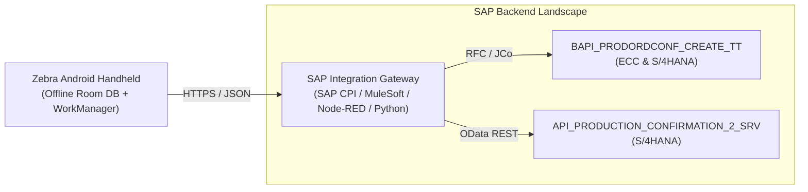

# SAP ERP Integration Guide for Machine Screen OCR

This guide documents the enterprise connection patterns, field mappings, and operational best practices for posting automated machine screen readings from Zebra rugged Android devices into SAP ERP (ECC 6.0 and S/4HANA).

---

## 1. Architecture Patterns



### Option A: SAP S/4HANA OData Service (Modern Cloud & On-Premise)
- **Standard Service**: `API_PRODUCTION_CONFIRMATION_2_SRV`
- **Entity Set**: `ProdnOrdConf2`
- **Protocol**: HTTPS REST JSON with CSRF token authentication
- **Payload**:
```json
{
  "ManufacturingOrder": "10049281",
  "ManufacturingOrderOperation": "0010",
  "Plant": "1000",
  "WorkCenter": "SPIN-LMW-01",
  "PostingDate": "2023-12-22T00:00:00",
  "ConfirmedYieldQuantity": "197.051",
  "ConfirmationUnit": "KGM",
  "IsFinalConfirmation": true,
  "MachineTime": "4.68",
  "MachineTimeUnit": "HUR",
  "ConfirmationText": "Shift 1 | Hanks: 60.802 | Doffs: 6 | Eff: 95.38%",
  "EnteredByExternalUser": "ZEBRA_AI_OCR"
}
```

### Option B: SAP BAPI via RFC Gateway (ECC 6.0 & S/4HANA)
- **Function Module**: `BAPI_PRODORDCONF_CREATE_TT` (Transaction `CO11N`)
- **Structure Mapping**:

| Machine Screen Field | Extracted Example | SAP BAPI Field | Data Type | Notes |
|---|---|---|---|---|
| Machine QR / Tag | `SPIN-LMW-01` | `TIMETICKETS-WORK_CNTR` | CHAR(8) | Work Center ID |
| Shift Date | `22/12/2023` | `TIMETICKETS-POSTG_DATE` | DATS(8) | Normalized to `YYYYMMDD` |
| Shift Number | `Shift - 1` | `TIMETICKETS-PERS_NO` / `CONF_TEXT` | CHAR | Shift identifier |
| Production Kgs | `197.051` | `TIMETICKETS-YIELD` | QUAN(13,3) | Actual yield quantity |
| Hanks Produced | `60.802` | `TIMETICKETS-CONF_TEXT` / `BAPI_TE_AFRU` | Custom | Textile hanks count |
| Run Time | `04:41` | `TIMETICKETS-ACT_WORK_2` | QUAN(13,3) | Converted to 4.68 Hours (`UN_WORK_2 = 'H'`) |
| Idle Time | `00:44` | `TIMETICKETS-ACT_WORK_3` | QUAN(13,3) | Converted to 0.73 Hours (`UN_WORK_3 = 'H'`) |
| Machine Efficiency | `95.38%` | `EXTENSION_IN (BAPI_TE_AFRU)` | NUMC | Custom append structure |
| Doffs Count | `6` | `EXTENSION_IN (BAPI_TE_AFRU)` | INT | Operations batch count |

---

## 2. Industrial Camera & Optical Best Practices for Factory Screens

Factory HMI screens present optical challenges (glare, reflections from overhead high-bay lights, scratches). Follow these rules on the shop floor:

1. **The 15-20° Tilt Rule**:
   - **Never photograph screens at a direct 90° angle**. A 90° perpendicular shot reflects direct factory ceiling lighting into the camera lens.
   - Instruct operators to tilt the Zebra handheld at **15° to 20°** to redirect glare away from the lens.

2. **Camera Exposure Compensation (-1.0 to -1.5 EV)**:
   - LCD/TFT screens emit their own backlight. Android auto-exposure often tries to expose for the dark bezel, overexposing and washing out the bright text on screen.
   - In the CameraX config, lock auto-exposure compensation (`setExposureCompensationIndex(-3)` or `-1.5 EV`).

3. **Machine Identification Barcode (Recommended)**:
   - Place a durable metal/vinyl QR code or DataMatrix sticker on the corner of the machine frame:
     `{"work_center":"SPIN-LMW-01","template":"lmw_blue_hmi","plant":"1000"}`
   - The operator squeezes the Zebra hardware scan trigger to scan the barcode. The app instantly switches to the exact machine template with pre-mapped bounding boxes.
